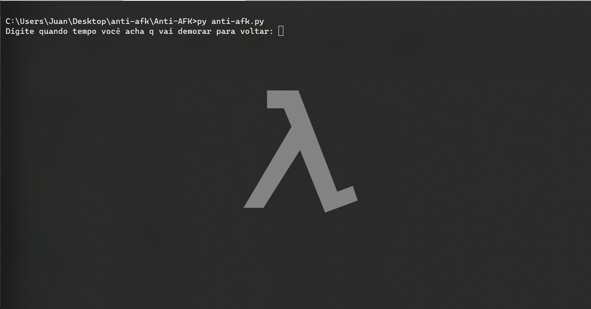
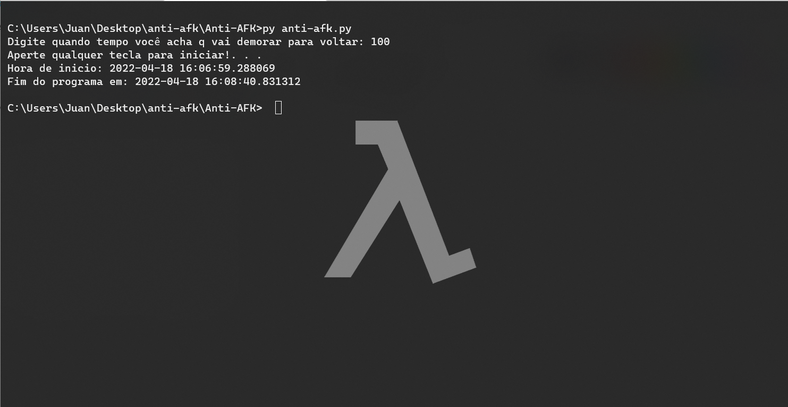

<h1>Anti-AFK</h1>
<h3>Um programa simples para evitar ficar AFK em MMORPGs.</h3>

---
<h2>Motivação</h2>

<p style="text-align:justify">Um server aonde jogo um MMORPG tem o sistema de auto afk "smart" em horas cheias no server, ou seja, ele tirar pessoas do server conforme a necessidade, mas o server também vende boost de fila para pessoas furarem fila de espera o que me faz acreditar, existir um caso aonde o próprio server faça essa "expulsão inteligente" mesmo não estando em horário de pico, sendo proposital para vender esses furas filas.</p>
<p>O uso está dividido em duas partes, clique na que achar mais fácil:</p>
<li style="margin-left: 50px"><a ref="#py">Uso via Python</a></li>
<li style="margin-left: 50px"><a ref="#exe">Uso via executável do Windows</a></li>


---
<h2 id="py"> Instalando e usando via Python </h2>

1. Baixe e instale python segundo o seu OS: [Link](https://www.python.org).
2. Digite ```pip install pyautogui``` no seu CMD/Shell e instale a dependência.
3. Faça o git clone da pasta e entre dentro dela.
4. Copie anti-afk.py para uma pasta de sua preferência, pode chama-la do que quiser. 
5. Adicione a pasta aonde anti-afk.py está no seu PATH do systema e execute-o com ```py anti-afk.py```
  5.1 Alternativamente, se instalado o python corretamente, ao abrir o anti-afk.py com dois cliques no arquivo, o programa irá iniciar automaticamente.
6. Ao inciar o programa, será pedido a quantidade de tempo em segundos em que vai ficar AFK para que o programa possa realizar comandos, como na imagem abaixo.

7. Digite a quantidade de tempo em segundos, depois o programa vai esperar qualquer tecla dentro do CMD/Shell para começar, lembrando que o input é um "teclado", então aonde for o foco do mouse, será aonde os comandos serão executados.

8. Pronto, pode ficar AFK sem ficar "AFK" :D

---
<h2 id="exe"> Usando versão distribuida .exe </h2>

1. Baixe o zip da pasta clicando em Code > Download Zip nesta página no github e faça extração dos arquivos.
2. Abra a pasta Anti-AFK-main
3. Entre na pasta dist e copie o anti-afk.exe para onde desejar e execute-o clicando duas vezes nele.
4. Ao inciar o programa, será pedido a quantidade de tempo em segundos em que vai ficar AFK para que o programa possa realizar comandos, como na imagem abaixo.

5. Digite a quantidade de tempo em segundos, depois o programa vai esperar qualquer tecla dentro do CMD/Shell para começar, lembrando que o input é um "teclado", então aonde for o foco do mouse, será aonde os comandos serão executados.

6. Pronto, pode ficar AFK sem ficar "AFK" :D
---

Independente do método de uso, caso queira termina o uso do programa, basta fecha-lo(o programa ou seu CMD/Shell).

O programa termina o seu processo sozinho após a execução.

## Resultado da verificação do .exe no virustotal:
#### [Clique aqui](https://www.virustotal.com/gui/file/d2049d36a54f354b073a726e8d9add5b28c0e84604dc50137f3c422ad7df4c6a?nocache=1)
#### Verificações de hashs, caso queira verificar o exe manualmente:
Tamanho: 59724842 bytes (56 MiB)

SHA256:
8A9490B1A864A32BC505F678E165BE33119607D69F6584A116439B53342B7644

SHA1:
9FC909A7FFA042FB644A00771E6772A6FD8C4FCF

---
## Outro
Atualmente estou usando pyinstaller para compilar Python o arquivo e gerar o .exe focado na plataforma do Windows, mas no virtualenv, o pyinstaller vem como genérico, resultando em false flags, se alguém souber resolver esse problema, por favor abre um "Issues" explicando, muito obrigado.

<h3>Bibliotecas usadas em Python</h3>
<li>pyautogui</li>
<li>Libs nativas do Python</li>
